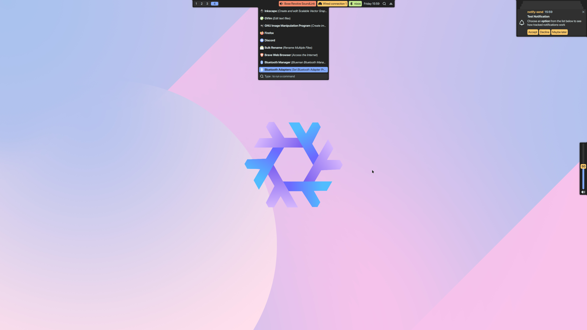

# monte-shell

A modern, feature-rich Wayland shell configuration built with [Quickshell](https://outfoxxed.me/quickshell/).



## Requirements

### Core Dependencies
- **Quickshell** - The shell framework (Qt-based QML shell)
- **Qt 6** with **qt5compat** module (provides QtQuick and QtQuick.Controls)
- **Wayland** compositor with `wlr-layer-shell` support
- **PipeWire** - Audio management
- **Linux** system

### Recommended Compositor
- **Niri** - Scrollable tiling compositor (includes workspace management integration)

### External Tools
- **deutils** - Desktop entry utilities for application launcher
- **niri** - For workspace and window management (if using Niri compositor)

### Optional Services
- **NetworkManager** - For network widget functionality
- **BlueZ** - For Bluetooth widget functionality
- **UPower** - For battery widget functionality

## Features

### 🎨 Theming System
- **Base16-inspired color scheme** - Material Palenight-based palette
- **Centralized design tokens** - Colors, spacing, icons, borders, and shadows
- **Custom components** - Consistent styling across all UI elements
- **Concave corners** - Unique rounded design language
- **Drop shadows** - Modern depth effects on panels

### 📊 Status Bar
Top panel with comprehensive system monitoring:
- **Workspace indicator** - Visual workspace switching (Niri integration)
- **Window title** - Shows active window
- **System tray** - Application indicators
- **Audio controls** - Volume control with PipeWire
- **Network status** - Connection info and management
- **Bluetooth** - Device management
- **Battery indicator** - Power status and percentage
- **Clock widget** - Date and time display
- **Launcher button** - Quick access to application launcher

### 🚀 Application Launcher
- **Fuzzy search** - Fast application finding
- **Desktop entry parsing** - Automatic application discovery
- **Grid layout** - Visual application icons
- **Keyboard navigation** - Quick launching
- **Custom command execution** - Run any command

### 🔔 Notification System
- **Desktop notifications** - Full notification daemon integration
- **Notification history** - View past notifications
- **Actions support** - Interactive notification buttons
- **Urgency levels** - Visual priority indicators
- **Auto-dismiss** - Configurable timeout
- **Images/icons** - Rich notification content

### 🔊 OSD (On-Screen Display)
- **Volume indicator** - Visual feedback for audio changes
- **Vertical slider** - Clean, modern design
- **Auto-hide** - Appears on volume change, disappears after timeout
- **Mute indicator** - Visual mute status
- **Percentage display** - Exact volume level

### 🧩 Custom Components
- **MContainer** - Styled container with rounded corners
- **MConcaveCorner** - Unique concave corner elements
- **MIcon** - SVG icon renderer with overlay support
- **MSlider** - Custom slider with horizontal/vertical orientation
- **MText** - Styled text component
- **MShadowEffect** - Drop shadow implementation
- **MOverlay** - Full-screen overlay manager

### 🎛️ Managers
- **PipewireManager** - Audio device and volume management
- **NiriManager** - Workspace and window state tracking
- **NetworkManager** - Network connection monitoring
- **BluetoothManager** - Bluetooth device management
- **NotificationManager** - Notification state and history
- **OverlayManager** - Overlay visibility control

### 🖥️ Multi-Monitor Support
- Automatic per-screen instance creation
- Independent bar on each display
- Shared launcher and notifications

## Configuration

### Theme Customization

All theme values are located in the `Config/` directory:

- **`MColors.qml`** - Color palette (Base16 scheme)
- **`MSpacing.qml`** - Spacing scale (xs, s, m, l, xl)
- **`MIcons.qml`** - Icon size scale (s, m, l, xl, xxl, xxxl)
- **`MBorder.qml`** - Border radius values
- **`MShadow.qml`** - Shadow properties

#### Example Color Customization

Edit `Config/MColors.qml` to change the color scheme:

````qml
pragma Singleton
import QtQuick
import Quickshell

Singleton {
    property color base00: "#212121"  // Background
    property color base01: "#303030"  // Lighter background
    property color base02: "#353535"  // Selection background
    property color base03: "#4A4A4A"  // Comments, invisibles
    property color base04: "#B2CCD6"  // Dark foreground
    property color base05: "#EEFFFF"  // Default foreground
    property color base06: "#EEFFFF"  // Light foreground
    property color base07: "#FFFFFF"  // Lightest foreground
    property color base08: "#F07178"  // Red
    property color base09: "#F78C6C"  // Orange
    property color base0A: "#FFCB6B"  // Yellow
    property color base0B: "#C3E88D"  // Green
    property color base0C: "#89DDFF"  // Cyan
    property color base0D: "#82AAFF"  // Blue
    property color base0E: "#C792EA"  // Purple
    property color base0F: "#FF5370"  // Magenta
}
````

> **TODO:** A JSON configuration file will be added to allow runtime theme customization without editing QML files.

### Widget Configuration

Widgets can be configured by editing the respective files in:
- `Modules/Bar/Widgets/` - Bar widgets
- `Modules/Bar/Popups/` - Popup panels
- `Modules/` - Main modules (Launcher, Notifications, OSD)

### Compositor Integration

The shell is designed for **Niri** but can be adapted for other Wayland compositors by:
1. Replacing `NiriManager.qml` with your compositor's IPC implementation
2. Updating workspace-related widgets

## Installation

1. **Install Quickshell** - Follow the [official installation guide](https://outfoxxed.me/quickshell/)

2. **Clone this repository:**
   ````bash
   git clone <repository-url> ~/.config/quickshell/monte-shell
   cd ~/.config/quickshell/monte-shell
   ````

3. **Install required dependencies** (Arch Linux example):
   ````bash
   sudo pacman -S qt6-5compat pipewire
   ````

4. **Launch the shell:**
   ````bash
   qs -c monte-shell
   ````

5. **Set up autostart** - Add to your compositor config or session startup

## Project Structure

````
monte-shell/
├── shell.qml                 # Entry point
├── Components/               # Reusable UI components
│   ├── MContainer.qml
│   ├── MConcaveCorner.qml
│   ├── MIcon.qml
│   ├── MSlider.qml
│   ├── MText.qml
│   ├── MShadowEffect.qml
│   └── MOverlay.qml
├── Config/                   # Theme configuration
│   ├── MColors.qml
│   ├── MSpacing.qml
│   ├── MIcons.qml
│   ├── MBorder.qml
│   └── MShadow.qml
├── Managers/                 # Service managers
│   ├── PipewireManager.qml
│   ├── NiriManager.qml
│   ├── NetworkManager.qml
│   ├── BluetoothManager.qml
│   ├── NotificationManager.qml
│   └── OverlayManager.qml
└── Modules/                  # Main UI modules
    ├── Bar/
    │   ├── Bar.qml
    │   ├── Widgets/          # Bar widgets
    │   └── Popups/           # Popup panels
    ├── Launcher/
    │   └── Launcher.qml
    ├── Notifications/
    │   └── Notifications.qml
    └── Osd/
        └── VolumeOsd.qml
````

## Development

### Adding a New Widget

1. Create a new QML file in `Modules/Bar/Widgets/`
2. Import necessary dependencies
3. Use `MContainer` and other M-components for consistent styling
4. Add the widget to `Bar.qml`

### Creating a New Theme

1. Copy the `Config/` directory
2. Modify color values in `MColors.qml`
3. Adjust spacing, icons, or other design tokens as needed
4. Switch between themes by changing imports

## License

MIT License

## Credits

- Built with [Quickshell](https://outfoxxed.me/quickshell/)
- Designed for [Niri compositor](https://github.com/YaLTeR/niri)
- Color scheme inspired by Material Palenight

## Contributing

Contributions are welcome! Please feel free to submit issues or pull requests.
